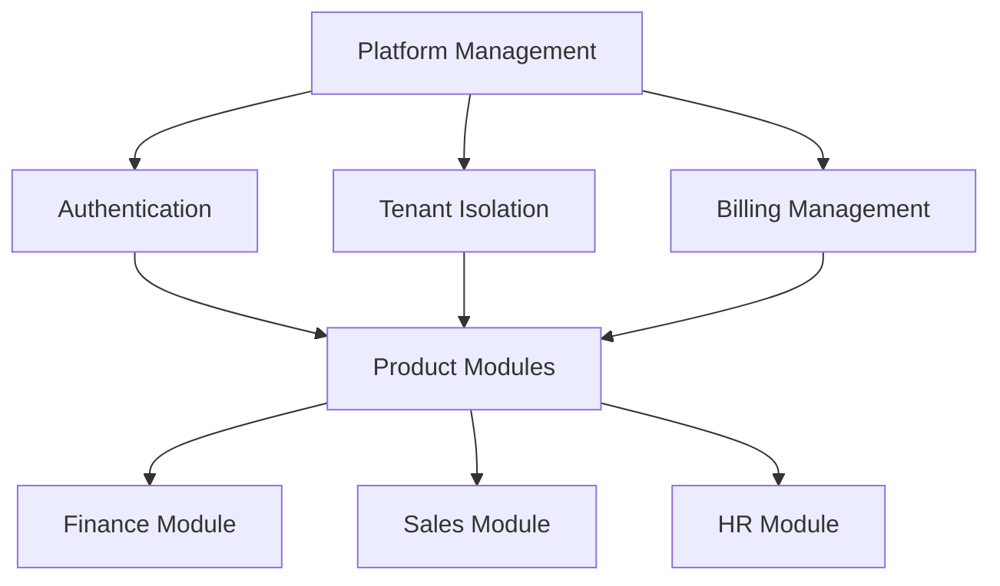
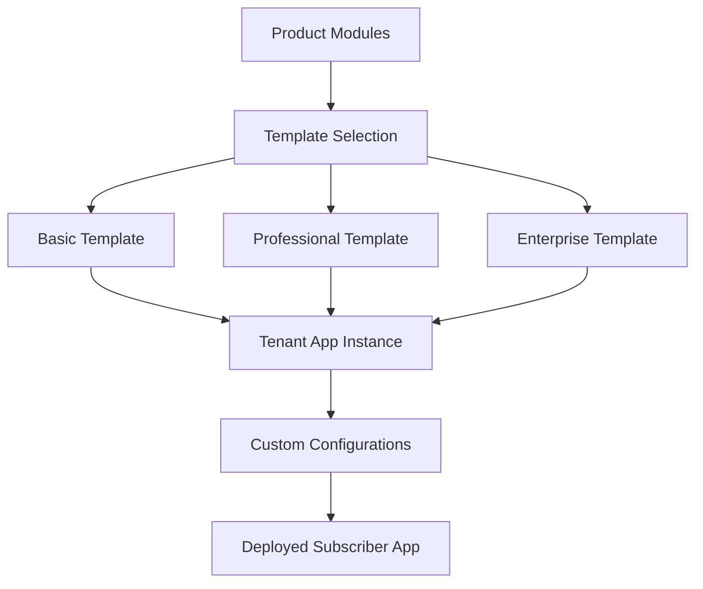

# 🏗️ PLATFORM ORGANIZATION STRUCTURE

## Multi-Tenant SaaS Platform Management

---

## 📁 **CURRENT STRUCTURE ANALYSIS**

### **✅ Existing Folders**

```
D:\Projects\DoganHubStore\
├── PlatformManagmet/          # Platform Management (fix typo)
├── Products/                  # Product Modules
├── Services/                  # Microservices
├── Archive/                   # Historical files
├── app/                       # Next.js app
└── components/                # Shared components
```

---

## 🎯 **RECOMMENDED PLATFORM STRUCTURE**

### **1. Platform Management Layer**

```yaml
PlatformManagement/            # Fixed name
├── Core/
│   ├── Authentication/        # Azure AD B2C, JWT, RBAC
│   ├── MultiTenant/          # Tenant isolation, RLS
│   ├── Billing/              # Stripe, subscriptions, usage
│   ├── Monitoring/           # Health checks, metrics
│   └── Security/             # Compliance, audit trails
│
├── Infrastructure/
│   ├── Azure/                # Container Apps, databases
│   ├── Networking/           # Front Door, API Management
│   ├── Storage/              # Blob storage, Redis
│   └── Deployment/           # CI/CD, scripts
│
├── APIs/
│   ├── Gateway/              # API Gateway configuration
│   ├── Routing/              # Multi-tenant routing
│   ├── Middleware/           # Auth, logging, rate limiting
│   └── Webhooks/             # Event handling
│
├── Admin/
│   ├── TenantManagement/     # Onboarding, configuration
│   ├── UserManagement/       # Cross-tenant user admin
│   ├── Analytics/            # Platform-wide analytics
│   └── Maintenance/          # System maintenance tools
│
└── Documentation/
    ├── Architecture/         # System design docs
    ├── Operations/           # Runbooks, procedures
    ├── Security/             # Security policies
    └── Compliance/           # Regulatory documentation
```

### **2. Product/Service Layer**

```yaml
Products/                      # Business Modules (Current)
├── Finance/                  # Finance & Accounting Module
│   ├── apps/                # Frontend components
│   ├── services/            # Backend services
│   ├── contracts/           # API contracts
│   ├── docs/                # Module documentation
│   └── tests/               # Module tests
│
├── Sales/                   # Sales & CRM Module
├── HR/                      # HR & Payroll Module
├── Procurement/             # Procurement Module
├── ProjectManagement/       # Project Management Module
├── AI/                      # AI & Automation Module
└── Compliance/              # Compliance & Audit Module

Services/                     # Microservices (Current)
├── Authentication/          # Auth service
├── Billing/                # Billing service
├── Notifications/          # Notification service
├── Analytics/              # Analytics service
├── AI/                     # AI services
└── Integration/            # Third-party integrations
```

### **3. Subscriber Apps Layer**

```yaml
SubscriberApps/              # New - Individual tenant apps
├── Templates/               # App templates
│   ├── Basic/              # Basic tenant template
│   ├── Professional/       # Professional template
│   ├── Enterprise/         # Enterprise template
│   └── Government/         # Government template
│
├── CustomApps/             # Custom tenant applications
│   ├── {tenant-id-1}/     # Tenant-specific customizations
│   ├── {tenant-id-2}/     # Another tenant's custom app
│   └── shared/            # Shared customizations
│
└── Deployment/             # Tenant deployment configs
    ├── Staging/           # Staging environments
    ├── Production/        # Production environments
    └── Scripts/           # Deployment automation
```

---

## 🔧 **IMPLEMENTATION PLAN**

### **Phase 1: Reorganize Platform Management**

```bash
# 1. Fix typo and reorganize
mv PlatformManagmet PlatformManagement

# 2. Create core structure
mkdir -p PlatformManagement/{Core,Infrastructure,APIs,Admin,Documentation}
mkdir -p PlatformManagement/Core/{Authentication,MultiTenant,Billing,Monitoring,Security}
mkdir -p PlatformManagement/Infrastructure/{Azure,Networking,Storage,Deployment}
mkdir -p PlatformManagement/APIs/{Gateway,Routing,Middleware,Webhooks}
mkdir -p PlatformManagement/Admin/{TenantManagement,UserManagement,Analytics,Maintenance}
mkdir -p PlatformManagement/Documentation/{Architecture,Operations,Security,Compliance}
```

### **Phase 2: Create Subscriber Apps Structure**

```bash
# Create subscriber apps structure
mkdir -p SubscriberApps/{Templates,CustomApps,Deployment}
mkdir -p SubscriberApps/Templates/{Basic,Professional,Enterprise,Government}
mkdir -p SubscriberApps/CustomApps/shared
mkdir -p SubscriberApps/Deployment/{Staging,Production,Scripts}
```

### **Phase 3: Migrate Existing Files**

```bash
# Move Archive files to appropriate locations
# Move deployment scripts to PlatformManagement/Infrastructure/Deployment/
# Move authentication files to PlatformManagement/Core/Authentication/
# Move billing files to PlatformManagement/Core/Billing/
```

---

## 📊 **PLATFORM MANAGEMENT RESPONSIBILITIES**

### **🎯 Platform Management Layer**

```yaml
Responsibilities:
  - Multi-tenant infrastructure management
  - Cross-tenant security and compliance
  - Platform-wide monitoring and analytics
  - Tenant onboarding and lifecycle management
  - Billing and subscription management
  - System maintenance and updates
  - Performance optimization
  - Disaster recovery and backup

Key Components:
  - Azure infrastructure management
  - Database schema management (520+ tables)
  - API Gateway and routing
  - Authentication and authorization
  - Monitoring and alerting
  - Compliance and audit trails
```

### **🏢 Product/Service Layer**

```yaml
Responsibilities:
  - Business module development
  - Feature implementation
  - Module-specific APIs
  - Business logic and workflows
  - Module testing and quality
  - Documentation and training

Key Components:
  - Finance & Accounting (80+ tables)
  - Sales & CRM (35+ tables)
  - HR & Payroll (20+ tables)
  - Procurement (25+ tables)
  - Project Management (30+ tables)
  - AI & Automation features
```

### **📱 Subscriber Apps Layer**

```yaml
Responsibilities:
  - Tenant-specific customizations
  - Custom workflows and processes
  - Branding and UI customization
  - Integration with tenant systems
  - Tenant-specific reporting
  - Custom feature development

Key Components:
  - Customizable templates
  - Tenant-specific configurations
  - Custom integrations
  - Branded interfaces
  - Specialized workflows
```

---

## 🔄 **MULTI-TENANT WORKFLOW**

### **1. Platform Management → Products**



### **2. Products → Subscriber Apps**



---

## 🛠️ **CONFIGURATION MANAGEMENT**

### **Platform-Level Configuration**

```yaml
# PlatformManagement/Core/config/platform.yaml
platform:
  name: "DoganHub Enterprise Platform"
  version: "2.0.0"
  environment: "production"
  
database:
  host: "fresh-maas-postgres.postgres.database.azure.com"
  name: "postgres"
  ssl: true
  
authentication:
  provider: "Azure AD B2C"
  tenant_id: "c8847e8a-33a0-4b6c-8e01-2e0e6b4aaef5"
  
billing:
  provider: "Stripe"
  webhook_endpoint: "/api/webhooks/billing-events"
```

### **Product-Level Configuration**

```yaml
# Products/Finance/config/module.yaml
module:
  name: "Finance & Accounting"
  version: "1.5.0"
  tables: 80
  
features:
  - chart_of_accounts
  - general_ledger
  - multi_currency
  - zatca_integration
  
dependencies:
  - authentication
  - multi_tenant
  - audit_logging
```

### **Subscriber-Level Configuration**

```yaml
# SubscriberApps/CustomApps/{tenant-id}/config/tenant.yaml
tenant:
  id: "tenant-123"
  name: "ABC Company"
  plan: "enterprise"
  
customizations:
  branding:
    logo: "/assets/tenant-123/logo.png"
    colors:
      primary: "#1a365d"
      secondary: "#2d3748"
  
modules:
    finance: 
      enabled: true
      features: ["zatca", "multi_currency"]
    sales:
      enabled: true
      features: ["pipeline", "forecasting"]
```

---

## 📈 **SCALABILITY ARCHITECTURE**

### **Horizontal Scaling**

```yaml
Platform Management:
  - Single instance per region
  - Manages all tenants in region
  - Cross-region replication for DR
  
Product Services:
  - Auto-scaling based on tenant load
  - Shared across multiple tenants
  - Resource pooling and optimization
  
Subscriber Apps:
  - Tenant-specific instances
  - On-demand scaling
  - Isolated resources for enterprise clients
```

### **Resource Allocation**

```yaml
Platform Management: 20% of resources
  - Infrastructure management
  - Monitoring and security
  - Tenant lifecycle management
  
Product Services: 60% of resources
  - Business logic processing
  - Data processing and storage
  - API request handling
  
Subscriber Apps: 20% of resources
  - Custom UI rendering
  - Tenant-specific processing
  - Custom integrations
```

---

## 🎯 **NEXT STEPS**

### **Immediate Actions (This Week)**

1. ✅ **Reorganize folder structure** - Fix PlatformManagmet typo
2. ✅ **Create SubscriberApps folder** - New structure for tenant apps
3. ✅ **Migrate Archive files** - Move to appropriate locations
4. ✅ **Update documentation** - Reflect new structure

### **Short-term (Next 2 Weeks)**

1. 🔄 **Implement platform management APIs** - Tenant lifecycle management
2. 🔄 **Create subscriber app templates** - Basic, Professional, Enterprise
3. 🔄 **Set up deployment automation** - Tenant-specific deployments
4. 🔄 **Configure monitoring** - Platform and tenant-level metrics

### **Long-term (Next Month)**

1. 🔄 **Advanced customization engine** - No-code tenant customizations
2. 🔄 **Multi-region deployment** - Global platform expansion
3. 🔄 **Advanced analytics** - Cross-tenant insights and benchmarking
4. 🔄 **Marketplace integration** - Third-party app ecosystem

---

## 🏆 **SUCCESS METRICS**

### **Platform Management KPIs**

- **Tenant Onboarding Time**: <24 hours
- **Platform Uptime**: >99.9%
- **Multi-tenant Isolation**: 100% data security
- **Cost per Tenant**: <$50/month platform overhead

### **Product Service KPIs**

- **Module Adoption Rate**: >80% feature utilization
- **API Response Time**: <200ms average
- **Module Reliability**: >99.5% uptime per module
- **Cross-module Integration**: Seamless data flow

### **Subscriber App KPIs**

- **Customization Time**: <4 hours for standard changes
- **Tenant Satisfaction**: >4.5/5 rating
- **Custom Feature Delivery**: <2 weeks development
- **App Performance**: <3 second load time

---

**This structure provides clear separation of concerns while maintaining the flexibility needed for a multi-tenant SaaS platform serving the Saudi market!** 🚀
